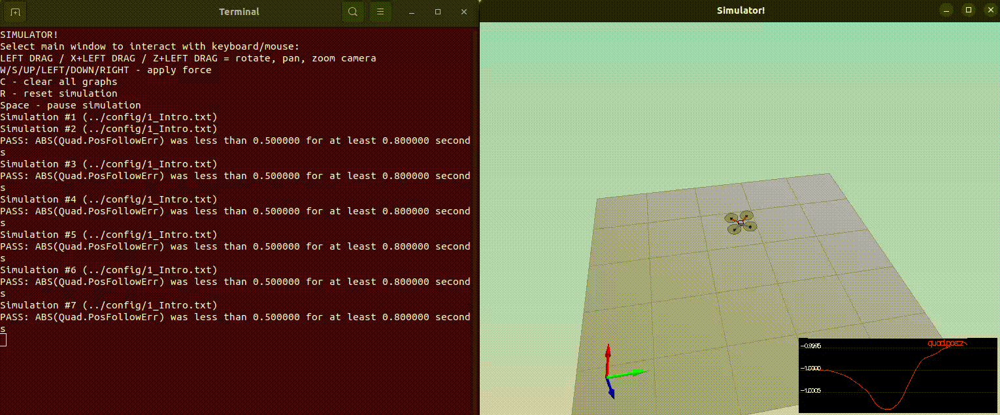
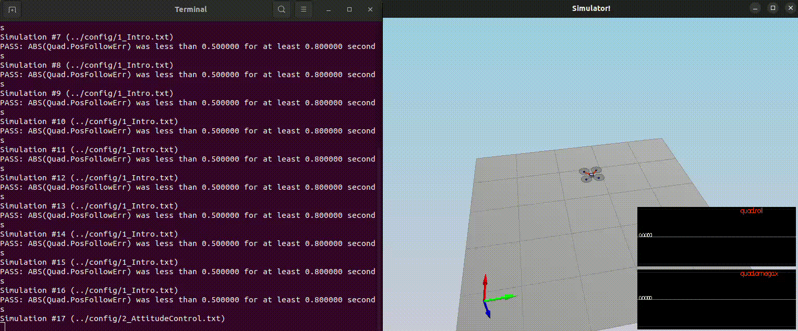
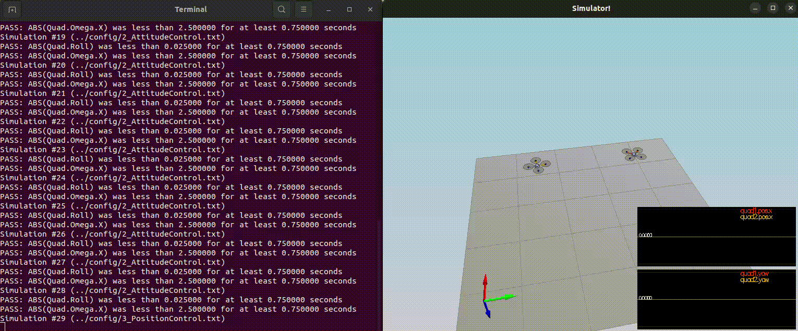
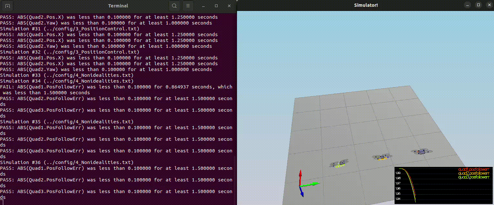

# Project: Building a Controller

---

## Requirements for a Passing Submission ([Rubric](https://review.udacity.com/#!/rubrics/1643/view) Points):
1. Provide a Writeup / README that includes all the rubric points and how you they were addressed.
2. Implement body rate control in C++.
3. Implement roll pitch control in C++.
4. Implement altitude controller in C++.
5. Implement lateral position control in C++.
6. Implement yaw control in C++.
7. Implement calculating the motor commands given commanded thrust and moments in C++.
8. Flight evaluation. The controller is successfully able to fly the provided test trajectory and visually passes inspection of the scenarios leading up to the test trajectory.

---

### 1. Provide a Writeup / README that includes all the rubric points and how you they were addressed.

You're reading it! Below I describe how I addressed each rubric point and where in my code each point is handled.

### 2. Implement body rate control in C++.

This function takes in two inputs, the desired body rates (pqrCmd) and the current or estimated body rates (pqr), and returns the moments to be applied on each of the three axes.

The function first calculates the error between the desired and current body rates. Then, it uses the error and the gain parameter kpPQR (a vector of three values) to calculate the moment for each axis.

The moments of inertia for each axis (Ixx, Iyy, and Izz) are also used in the calculations. Notice the sign of the moment around the z-axis; it took quite some time to debug. 

In simpler terms, this function helps the quadcopter adjust its rotation rates by calculating the desired moments needed to achieve the desired body rates.

 ``` c++
V3F QuadControl::BodyRateControl(V3F pqrCmd, V3F pqr)
{
  // Calculate a desired 3-axis moment given a desired and current body rate
  // INPUTS: 
  //   pqrCmd: desired body rates [rad/s]
  //   pqr: current or estimated body rates [rad/s]
  // OUTPUT:
  //   return a V3F containing the desired moments for each of the 3 axes

  // HINTS: 
  //  - you can use V3Fs just like scalars: V3F a(1,1,1), b(2,3,4), c; c=a-b;
  //  - you'll need parameters for moments of inertia Ixx, Iyy, Izz
  //  - you'll also need the gain parameter kpPQR (it's a V3F)

  V3F momentCmd;

  ////////////////////////////// BEGIN STUDENT CODE ///////////////////////////

  V3F error;
  error = pqrCmd - pqr;
  momentCmd[0] = Ixx * kpPQR.x * error[0];
  momentCmd[1] = Iyy * kpPQR.y * error[1];
  momentCmd[2] = -Izz * kpPQR.z * error[2];

  /////////////////////////////// END STUDENT CODE ////////////////////////////

  return momentCmd;
}
 ```

### 3. Implement roll pitch control in C++.

This function takes in three inputs:

   * The desired global acceleration in the XY plane
   * The current attitude (orientation) of the quadcopter
   * The collective thrust command

Based on these inputs, it then calculates the desired pitch and roll rates (how fast the quadcopter should be tilting forward/backward and left/right).
The function first converts the attitude quaternion into a rotation matrix (provided). It then calculates the desired tilt angles based on the acceleration and collective thrust command.

Finally, it uses a proportional gain parameter (kpBank) to calculate the desired pitch and roll rates to achieve the desired tilt angles.
Overall, this function helps the quadcopter adjust its pitch and roll rates to achieve the desired movement and orientation.

 ``` c++
V3F QuadControl::RollPitchControl(V3F accelCmd, Quaternion<float> attitude, float collThrustCmd)
{
  // Calculate a desired pitch and roll angle rates based on a desired global
  //   lateral acceleration, the current attitude of the quad, and desired
  //   collective thrust command
  // INPUTS: 
  //   accelCmd: desired acceleration in global XY coordinates [m/s2]
  //   attitude: current or estimated attitude of the vehicle
  //   collThrustCmd: desired collective thrust of the quad [N]
  // OUTPUT:
  //   return a V3F containing the desired pitch and roll rates. The Z
  //     element of the V3F should be left at its default value (0)

  // HINTS: 
  //  - we already provide rotation matrix R: to get element R[1,2] (python) use R(1,2) (C++)
  //  - you'll need the roll/pitch gain kpBank
  //  - collThrustCmd is a force in Newtons! You'll likely want to convert it to acceleration first

  V3F pqrCmd;
  Mat3x3F R = attitude.RotationMatrix_IwrtB();

  ////////////////////////////// BEGIN STUDENT CODE ///////////////////////////

  pqrCmd = V3F(0.f, 0.f, 0.f);
  float c = -collThrustCmd /mass;

  if (collThrustCmd > 0.0)
  {
      float r13Cmd = CONSTRAIN(accelCmd.x / c, -maxTiltAngle , maxTiltAngle);
      float r23Cmd = CONSTRAIN(accelCmd.y / c, -maxTiltAngle , maxTiltAngle);

      pqrCmd.x = (1/R(2, 2)) * (-R(1, 0) * kpBank * (R(0, 2) - r13Cmd) + R(0, 0) * kpBank * (R(1, 2) - r23Cmd));
      pqrCmd.y = (1/R(2, 2)) * (-R(1, 1) * kpBank * (R(0, 2) - r13Cmd) + R(0, 1) * kpBank * (R(1, 2) - r23Cmd));
   }
  /////////////////////////////// END STUDENT CODE ////////////////////////////
  pqrCmd.z = 0.f;

  return pqrCmd;
}
 ```
### 4. Implement altitude controller in C++.

This function is responsible for controlling the altitude of the quadcopter. It takes in several inputs, including the desired vertical position and velocity, the current vertical position and velocity, and a feed-forward vertical acceleration command.

The function first converts the attitude quaternion into a rotation matrix (provided). It then calculates the error between the desired and current vertical positions. It uses a proportional gain parameter (kpPosZ) and an integral gain parameter (KiPosZ) to calculate a desired vertical acceleration. An anti-windup term limits the integral action.

The function also constrains the desired vertical velocity to ensure it does not exceed the maximum ascent or descent rates.

Finally, the function calculates the desired thrust needed to achieve the desired vertical acceleration, considering the feed-forward acceleration command and the force of gravity.

In summary, this function helps the quadcopter maintain its desired altitude by adjusting its thrust.

 ``` c++
float QuadControl::AltitudeControl(float posZCmd, float velZCmd, float posZ, float velZ, Quaternion<float> attitude, float accelZCmd, float dt)
{
  // Calculate desired quad thrust based on altitude setpoint, actual altitude,
  //   vertical velocity setpoint, actual vertical velocity, and a vertical 
  //   acceleration feed-forward command
  // INPUTS: 
  //   posZCmd, velZCmd: desired vertical position and velocity in NED [m]
  //   posZ, velZ: current vertical position and velocity in NED [m]
  //   accelZCmd: feed-forward vertical acceleration in NED [m/s2]
  //   dt: the time step of the measurements [seconds]
  // OUTPUT:
  //   return a collective thrust command in [N]

  // HINTS: 
  //  - we already provide rotation matrix R: to get element R[1,2] (python) use R(1,2) (C++)
  //  - you'll need the gain parameters kpPosZ and kpVelZ
  //  - maxAscentRate and maxDescentRate are maximum vertical speeds. Note they're both >=0!
  //  - make sure to return a force, not an acceleration
  //  - remember that for an upright quad in NED, thrust should be HIGHER if the desired Z acceleration is LOWER

  Mat3x3F R = attitude.RotationMatrix_IwrtB();
  float thrust = 0;

  ////////////////////////////// BEGIN STUDENT CODE ///////////////////////////

  static float iZPosError = 0.0f; // Declare integral error as a static variable to maintain its value between function calls
  float zPosError = posZCmd - posZ;
  const float antiWindup = 0.1f;
  const float g = 9.81f;

  iZPosError+= zPosError * dt;

  iZPosError = CONSTRAIN(iZPosError, -antiWindup, antiWindup); // Clamp the integral error as windup protection

  velZCmd  = CONSTRAIN(velZCmd , -maxDescentRate, maxAscentRate);

  thrust = -mass * (kpPosZ * zPosError + KiPosZ * iZPosError + kpVelZ * (velZCmd - velZ) + accelZCmd - g )/R(2,2);

  /////////////////////////////// END STUDENT CODE ////////////////////////////
  
  return thrust;
}
 ```

### 5. Implement lateral position control in C++.

This function controls the lateral position of the quadcopter. It takes in several inputs, including the desired lateral position, velocity, acceleration, and current position and velocity.

The function first sets the z-component of the feed-forward acceleration to zero since we are only interested in controlling the lateral position. It also sets the desired z-position to be equal to the current z-position (provided as starter code).

The function then initializes the desired acceleration to the feed-forward acceleration (also provided). It calculates the error between the desired and current lateral positions and uses a proportional gain parameter (kpPosXY) and a derivative gain parameter (kpVelXY) to calculate a desired lateral acceleration.

The function also constrains the desired lateral velocity and acceleration to ensure they do not exceed the maximum values.

This implementation is not exactly a cascaded controller but rather a PD (proportional-derivative) controller with a feed-forward term. The feed-forward term is added to the output of the PD controller to improve its performance.

```c++
V3F QuadControl::LateralPositionControl(V3F posCmd, V3F velCmd, V3F pos, V3F vel, V3F accelCmdFF)
{
  // Calculate a desired horizontal acceleration based on 
  //  desired lateral position/velocity/acceleration and current pose
  // INPUTS: 
  //   posCmd: desired position, in NED [m]
  //   velCmd: desired velocity, in NED [m/s]
  //   pos: current position, NED [m]
  //   vel: current velocity, NED [m/s]
  //   accelCmdFF: feed-forward acceleration, NED [m/s2]
  // OUTPUT:
  //   return a V3F with desired horizontal accelerations. 
  //     the Z component should be 0
  // HINTS: 
  //  - use the gain parameters kpPosXY and kpVelXY
  //  - make sure you limit the maximum horizontal velocity and acceleration
  //    to maxSpeedXY and maxAccelXY

  // make sure we don't have any incoming z-component
  accelCmdFF.z = 0;
  velCmd.z = 0;
  posCmd.z = pos.z;

  // we initialize the returned desired acceleration to the feed-forward value.
  // Make sure to _add_, not simply replace, the result of your controller
  // to this variable
  V3F accelCmd = accelCmdFF;

  ////////////////////////////// BEGIN STUDENT CODE ///////////////////////////

  const V3F kpPos = V3F(kpPosXY, kpPosXY,0.f);
  const V3F kpVel = V3F(kpVelXY, kpVelXY, 0.f);

  if (velCmd.mag() > maxSpeedXY) {
      velCmd = velCmd.norm() * maxSpeedXY;
  }
  else {
      //do nothing
  }

  //PD with FF acc
  accelCmd += kpPos * (posCmd - pos) + kpVel * (velCmd - vel);

  if (accelCmd.mag() > maxAccelXY) {
      accelCmd= accelCmd.norm() * maxAccelXY;
  }
  else {
      //do nothing
  }

  /////////////////////////////// END STUDENT CODE ////////////////////////////

  return accelCmd;
}

```

### 6. Implement yaw control in C++.

This function is used for controlling the yaw of the quadcopter. It takes in the desired and current yaw angles and returns the desired yaw rate.

The function first ensures that the yaw angles are within the range of 0 to 2π radians. It then calculates the error between the desired and current yaw angles.

The function calculates the desired yaw rate using a proportional gain parameter (kpYaw). The proportional gain parameter determines how quickly the quadcopter should respond to changes in the desired yaw angle.

The function uses a simple proportional controller to control the quadcopter's yaw.

```c++
float QuadControl::YawControl(float yawCmd, float yaw)
{
  // Calculate a desired yaw rate to control yaw to yawCmd
  // INPUTS: 
  //   yawCmd: commanded yaw [rad]
  //   yaw: current yaw [rad]
  // OUTPUT:
  //   return a desired yaw rate [rad/s]
  // HINTS: 
  //  - use fmodf(foo,b) to unwrap a radian angle measure float foo to range [0,b]. 
  //  - use the yaw control gain parameter kpYaw

  float yawRateCmd=0;
  ////////////////////////////// BEGIN STUDENT CODE ///////////////////////////

  float cappedYaw = fmodf(yaw, 2 * F_PI);
  float cappedYawCmd = 0;

  if ( yawCmd > 0 )
  {
    cappedYawCmd = fmodf(yawCmd, 2 * F_PI);
  }
  else
  {
    cappedYawCmd = fmodf(-yawCmd, 2 * F_PI);
  }
  //float error = cappedYawCmd - cappedYaw;
  float error = yawCmd - yaw;

  if (error > F_PI)
  {
      error -= 2 * F_PI;
  }
  else if (error< -F_PI)
  {
      error += 2 * F_PI;
  }
  yawRateCmd=  kpYaw * error;

  /////////////////////////////// END STUDENT CODE ////////////////////////////

  return yawRateCmd;

}
```

### 7. Implement calculating the motor commands given commanded thrust and moments in C++.

This function converts a desired collective thrust and moment command into individual motor thrust commands. It takes the collective thrust command and the desired rotation moment about each axis and sets the class member variable cmd to the desired motor thrust commands.

A system of equations that relates the total thrust and moments to the individual motor thrusts is solved for the respective motor thrusts F1, F2, F3, and F4 to find the expressions implemented in the code. 

The function then calculates common coefficients and checks for division by zero. It calculates four terms that correspond to the desired thrust contribution from each of the four inputs:
   * Collective thrust
   * Moment about the x-axis
   * Moment about the y-axis
   * Moment about the z-axis

Finally, the function assigns the desired thrusts to each of the four motors, considering the motor numbering convention used in the quadcopter.

Attention to the motor numbering convention is essential to ensure clarity when assigning the desired thrusts to each motor.

```c++
VehicleCommand QuadControl::GenerateMotorCommands(float collThrustCmd, V3F momentCmd)
{
  // Convert a desired 3-axis moment and collective thrust command to 
  //   individual motor thrust commands
  // INPUTS: 
  //   collThrustCmd: desired collective thrust [N]
  //   momentCmd: desired rotation moment about each axis [N m]
  // OUTPUT:
  //   set class member variable cmd (class variable for graphing) where
  //   cmd.desiredThrustsN[0..3]: motor commands, in [N]

  // HINTS: 
  // - you can access parts of momentCmd via e.g. momentCmd.x
  // You'll need the arm length parameter L, and the drag/thrust ratio kappa
  ////////////////////////////// BEGIN STUDENT CODE ///////////////////////////
  //
  //  The following system of equations is solved for F1,F2,F3 and  F4
  //  F1 + F2 + F3 + F4 = F_total
  //  F1+ F4 - F2 - F3 = tau_x / L
  //  F1 + F2 - F3 - F4 = tau_y / L
  //  F1 - F2 + F3 -F4 = tau_z / kappa
  //  Important note: the signs in the tau_z equation are inverted in the lesson:
  //  https://knowledge.udacity.com/questions/251050
  //Common coefficients and division by zero checks
  float l = L / (2.f * sqrtf(2.f));
  float invDivisor1 = (l != 0.0f) ? (1.0f / (4.0f * l)) : 0.0f;
  float invDivisor2 = (kappa != 0.0f) ? (1.0f / (4.0f * kappa)) : 0.0f;

  float term1 = collThrustCmd / 4.0f;
  float term2 = momentCmd.x * invDivisor1;
  float term3 = momentCmd.y * invDivisor1;
  float term4 = momentCmd.z * invDivisor2;

  cmd.desiredThrustsN[0] = term1 + term2 + term3 + term4; //front left
  cmd.desiredThrustsN[1] = term1 - term2 + term3 - term4; //front right
  cmd.desiredThrustsN[2] = term1 + term2 - term3 - term4; //rear right
  cmd.desiredThrustsN[3] = term1 - term2 - term3 + term4; //rear left


  /////////////////////////////// END STUDENT CODE ////////////////////////////

  return cmd;
}
```
### 8. Flight evaluation.
It works! The same set of gains works for all the scenarios evaluated and all were marked as PASS.

#### Scenario 1


#### Scenario 2


#### Scenario 3


#### Scenario 4


#### Scenario 5

After a bumpy start, both quads manage to follow the 8-like trajectories.


  


